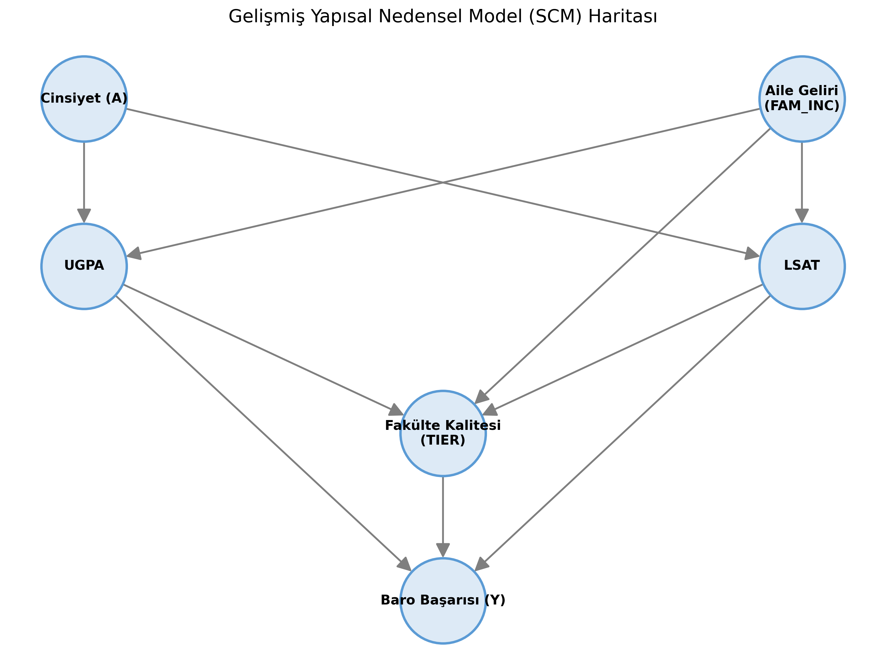
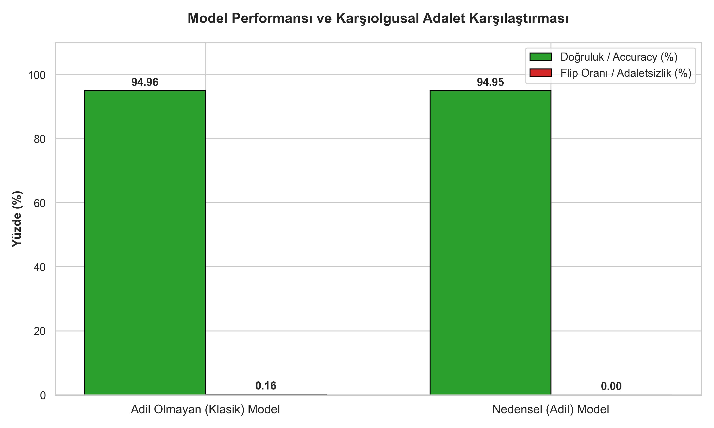

# ⚖️ Yapısal Nedensel Model (SCM) ile Algoritmik Adalet ve Karşıolgusal Analiz

> **Proje Özeti:** Makine öğrenmesi tahmin modellerinde, cinsiyet gibi hassas niteliklerin yarattığı dolaylı ayrımcılığı (bias), Yapısal Nedensel Modeller (SCM) ve karşıolgusal (counterfactual) simülasyonlar kullanarak tespit eden ve gideren bir algoritmik adalet (causal fairness) analiz projesidir.

---

## 📖 Detaylı Açıklama

Günümüzde algoritmik karar alma sistemleri, veri setlerindeki tarihsel önyargıları öğrenerek ayrımcı sonuçlar üretebilmektedir. Bu proje, hukuk fakültesi öğrenci verilerini temel alarak **Baro Başarısını** tahmin ederken, **Cinsiyet** değişkeninin diğer değişkenler (Aile Geliri, UGPA, LSAT, Fakülte Kalitesi vb.) üzerindeki dolaylı ve haksız etkilerini ortadan kaldırmayı amaçlar. 

Proje, **Nedensel Çıkarım (Causal Inference)** ilkelerine dayanarak şu süreçleri yönetir:

1. **Abduction (Açımlama):** Bireyin performansını etkileyen cinsiyet dışı saf ve gözlemlenemeyen ($U$) yetenek/efor faktörlerinin denklemler yoluyla hesaplanması.
2. **Intervention (Müdahale/Simülasyon):** Kişinin cinsiyeti farklı olsaydı hayatındaki diğer değişkenlerin zincirleme olarak nasıl şekilleneceğinin karşıolgusal (counterfactual) olarak simüle edilmesi.
3. **Evaluation (Değerlendirme):** Saf $U$ faktörleriyle eğitilen **Adil Model** ile gerçek hayat verisiyle eğitilen **Klasik Modelin**, Doğruluk (Accuracy) ve Adaletsizlik (Flip Oranı) metrikleri üzerinden kıyaslanması.

---

## 🛠 Kullanılan Teknolojiler

Proje tamamen **Python** ekosistemi üzerinde geliştirilmiş olup, nedensellik ve veri analizi için endüstri standardı kütüphaneler kullanmaktadır:

- **Python 3.x**
- **Statsmodels:** İstatistiksel regresyonlar, katsayı analizi ve kalıntı (residual) hesaplamaları için.
- **Pandas & NumPy:** Veri işleme, manipülasyon ve matris işlemleri için.
- **NetworkX:** Nedensel ilişkilerin (DAG) matematiksel olarak kurulması için.
- **Matplotlib & Seaborn:** DAG tablolarının ve veri seti istatistiklerinin görselleştirilmesi için.

---

## ⚙️ Gereksinimler & Kurulum

Projeyi yerel makinenizde çalıştırmak için ilgili Python ortamınızda aşağıdaki kütüphanelerin yüklü olması gerekmektedir. Bağımlılıkları terminalinizde tek bir komutla kurabilirsiniz:

```bash
# Gerekli Python kütüphanelerini kurun
pip install pandas numpy statsmodels scikit-learn networkx matplotlib seaborn
```

> **Önemli Not:** Projeyi çalıştırabilmeniz için temizlenmiş ham veriye (`lsac_clean.csv`) ihtiyacınız vardır. Bu dosyayı elde etmek için öncelikle projenin **ana dizininde** bulunan veri ön işleme betiğini çalıştırmalısınız:
> ```bash
> # Ana dizindeki (root) terminalde çalıştırın
> python preprocessing.py
> ```
> Oluşan `lsac_clean.csv` dosyasının, çalışacağınız (bu klasör) dizininde bulunduğundan emin olun.

---

## 🚀 Kullanım ve Dosyaların Anlamsal Çıkarımları

Proje içerisindeki Python script'leri mantıksal bir sıralama ile çalıştırılmalıdır. Sistemdeki her bir dosyanın projedeki rolü ve ürettiği sonuçlar şöyledir:

### 1. Veri Seti Genel Analizi (`dataset_genel_analiz.py`)
Model eğitimine ve nedensel simülasyonlara başlamadan önce `lsac_clean.csv` veri setinin genel istatistiksel durumunu analiz eder.

**Çalıştırma Komutu:**
```bash
python dataset_genel_analiz.py
```
* **Mantıksal Çıkarım:** Öğrencilerin LSAT puanları, lisans ortalamaları, aile gelir dağılımları ve cinsiyet oranları gibi temel istatistiklerini terminal üzerinden raporlar. Aynı zamanda verilerin genel dağılım grafiğini çizerek projenin dayanacağı verinin fotoğrafını çeker.
* **Çıktı:** Konsolda genel özet raporu ve dizin içerisinde `Genel_Veri_Seti_Dagilimi.png` görselini üretir.

---

### 2. Nedensel Haritanın Çıkarılması (`DAG.py`)
Değişkenler arası nedensel bağların şematik haritasını (Yönlü Döngüsüz Graf - DAG) oluşturur.

**Çalıştırma Komutu:**
```bash
python DAG.py
```
* **Mantıksal Çıkarım:** Veri setindeki Cinsiyet, Aile Geliri, Notlar ve Baro Başarısı arasındaki etki-tepki zincirini matematiksel bir yapıya (graf) döker. Sistemin hangi yönde aktığını görselleştirerek modelin teorik altyapısını temellendirir.
* **Çıktı:** Klasörde `csv/Cinsiyet_Dag_Tablosu.csv` dosyasını (matematiksel bağlantılar tablosu) ve görsel olarak `assets/Gelişmiş_DAG_Haritası.png` dosyasını üretir.



---

### 3. Modellerin Eğitilmesi ve Simülasyon (`TrainModel.py`)
Kalıntı değişkenleri hesaplar ve paralel evren (karşıolgusal) verilerini türetir.

**Çalıştırma Komutu:**
```bash
python TrainModel.py
```
* **Mantıksal Çıkarım:** Sistem öncelikle, kişinin başarılarına etki eden cinsiyet ve gelir gibi dış etkenleri izole edip, kişinin sadece "kendi çabasını/genel faktörleri" temsil eden saf kalıntı değerlerini ($U$ matrisleri) bulur. Ardından *"Bu kişilerin cinsiyeti farklı olsaydı, notları ve fakülte başarıları nasıl değişirdi?"* sorusunun simülasyonunu yapar.
* **Çıktı:** Adil bir öğrenme için arındırılmış `csv/lsac_with_U_zengin.csv` ve karşıolgusal `csv/lsac_counterfactual_sim_zengin.csv` veri setlerini oluşturarak sisteme kaydeder.

---

### 4. Modellerin Karşılaştırılması ve Nihai Raporlama (`nihai_degerlendirme.py`)
Modelleri rekabet ettirir ve adaletsizlik (bias) ölçümü yapar.

**Çalıştırma Komutu:**
```bash
python nihai_degerlendirme.py
```
* **Mantıksal Çıkarım:** Arındırılmış faktörlerle eğitilen "Nedensel Adil Model" ile ayrımcı olabilecek dış etkenleri içeren "Klasik Model", cinsiyetin tersine çevrildiği veriler üzerinde teste tabi tutulur. Model doğruluğunun (Accuracy) yanı sıra, cinsiyet değiştiğinde verilen baro kararının ne kadar değiştiğini gösteren Adaletsizlik (Flip) oranı ölçülür.
* **Çıktı:** Sonuçlar `assets/Model_Karsilastirma_Grafikleri.png` ile görselleştirilir ve klasik modellerin kırılganlığına karşın, adil modellerin yapısal istikrarı bilimsel bir profesyonellikte kanıtlanmış olur.


