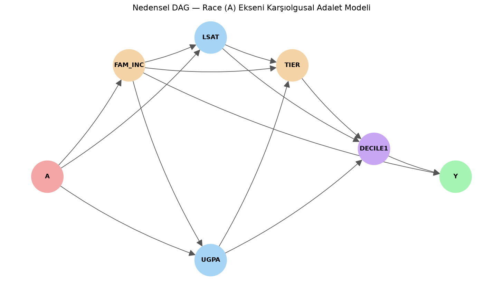

# Yapısal Nedensel Modeller (SCM) ile Algoritmik Adalet ve Karşıolgusal Analiz

> **Proje Özeti:** Makine öğrenmesi tahmin modellerinde, cinsiyet gibi hassas niteliklerin yarattığı dolaylı ayrımcılığı (bias), Yapısal Nedensel Modeller (SCM) ve karşıolgusal (counterfactual) simülasyonlar kullanarak tespit eden ve gideren bir algoritmik adalet (causal fairness) analiz projesidir.

---

## Yönetici Özeti (Executive Summary)

Günümüzde bankacılık, insan kaynakları ve hukuk sistemi gibi kritik alanlarda kullanılan makine öğrenmesi (ML) algoritmaları, eğitildikleri verilerdeki tarihsel eşitsizlikleri kopyalayarak azınlık grupları aleyhine ayrımcı (bias) sonuçlar üretmektedir. Geleneksel yöntemler "cinsiyet" veya "ırk" sütununu veri setinden çıkarmanın adalet sağlayacağını varsaysa da, algoritmalar adres, eğitim durumu veya gelir düzeyi gibi dolaylı değişkenler (proxy) üzerinden bu ayrımcılığı yeniden inşa etmektedir.

Bu proje, bir hukuk fakültesi öğrencisinin baro başarısını tahmin ederken **Nedensel Çıkarım (Causal Inference)** prensiplerini kullanarak demografik dezavantajları izole eder. Model, adayın gerçek çabasını ve yeteneğini matematiksel bir denklemle hesaplar ve ayrımcılığı kökünden çözen **Karşıolgusal Adil (Counterfactually Fair)** bir yapay zeka sistemi sunar.

---

## Teorik Altyapı: Judea Pearl ve Nedensel Merdiven

Proje, Turing ödüllü Judea Pearl'ün "Nedensellik Merdiveni" kavramını temel alır. Geleneksel yapay zeka sadece *İlişkilendirme (Association)* düzeyinde kalırken, bu mimari en üst düzey olan **Karşıolgusal (Counterfactual)** mantıkla çalışır ve 3 ana adımı uygular:

1. **Abduction (Kalıntı/Saf Yetenek Bulma):** Sistem, bireyin geliri veya sınav notu üzerindeki "Cinsiyet/Irk" etkisini istatistiksel (regresyon) olarak çıkarır. Geriye kalan açıklanamayan kısım (U Faktörü - Residual), bireyin demografik avantaj/dezavantajlarından arınmış "saf eforu" olarak tanımlanır.
2. **Action / Intervention (Müdahale):** Öğrencinin özellikleri (eforu) aynı kalmak şartıyla, matematiksel bir paralel evrende *sadece ırkı veya cinsiyeti tersine çevrilerek (örn: azınlık olsaydı)* tüm hayatındaki diğer faktörlerin (gelir, notlar) zincirleme nasıl değişeceği simüle edilir.
3. **Prediction (Tahmin):** Üretilen bu karşıolgusal veriler üzerinden modellerin adalet kırılganlıkları test edilir.

---

## Metrikler: Adaletin Matematiksel İspatı

Kurulan modellerin performansı sadece doğrulukla değil, aynı zamanda etik dayanıklılıkla ölçülmektedir:

* **Doğruluk (Accuracy):** Modelin hedef değişkeni (Baro Başarısı) doğru tahmin etme yüzdesi.
* **Flip Oranı (Adaletsizlik / Kırılganlık Oranı):** Klasik bir algoritmaya, bir adayın çabası (U) aynı kalıp **sadece ırkı/cinsiyeti** değiştirilerek sorulduğunda kararını değiştirme yüzdesidir. 
  * *Gerçek adaletin (Causal Fairness) sağlandığı sistemlerde, dış faktörler değişse de bireyin saf yeteneği değişmediği için Flip Oranının %0 (mutlak istikrar) olması hedeflenmektedir.*

---

## Veri Seti (LSAC Bar Pass)

Projede kullanılan Hukuk Fakültesine Giriş Konseyi (LSAC - Law School Admission Council) veri seti, yapay zeka etiği ve Fairness (Adalet) literatüründe bir endüstri standardı ve benchmark olarak kabul edilmektedir. LSAT puanları, lisans not ortalamaları (UGPA), aile geliri (FAM_INC) ve fakülte kalitesi (TIER) gibi güçlü metrikler içermektedir.

### Veri Sözlüğü (Data Dictionary)
Projede kullanılan LSAC veri seti, hukuk öğrencilerinin akademik ve demografik geçmişlerini yansıtan şu değişkenlerden oluşmaktadır:

| Değişken | Açıklama |
| :--- | :--- |
| **FAM_INC** | Aile Geliri (Family Income) - Hiyerarşik gelir dilimleri. |
| **LSAT** | Hukuk Fakültesine Giriş Sınavı Puanı (Law School Admission Test). |
| **UGPA** | Lisans Not Ortalaması (Undergraduate GPA). |
| **TIER** | Kabul Alınan Hukuk Fakültesinin Kalite/Prestij Derecesi. |
| **DECILE1**| Hukuk Fakültesindeki ilk yıl başarı dilimi (Performans). |
| **A (Race/Gender)**| **Hassas Öznitelik:** Bireyin ırk veya cinsiyet bilgisi. |
| **Y (Pass_Bar)**| **Hedef Değişken:** Baro sınavını geçme durumu (1=Geçti, 0=Kaldı). |

---

### "U Faktörü"nün Matematiksel Tanımı
**Abduction (Kalıntı Bulma)** aşamasında sistem, öğrencinin tarihsel dezavantajlardan arınmış *saf yeteneğini (U)* hesaplar. Matematiksel olarak bir bireyin saf yeteneği ($U$); gerçekleşen performansından, demografik önyargıların (Model Tahmini) çıkarılmasıyla elde edilir:

> **U (Saf Efor/Yetenek) = Gerçekleşen Değer − f(Hassas Öznitelik, Dış Etkenler)**

*Örnek:* Dezavantajlı gruptaki bir öğrencinin LSAT puanı düşük görünse bile, grubunun ortalamasına göre gösterdiği ekstra çaba yüksekse, modeli besleyen $U_{LSAT}$ (kalıntı) değeri yüksek çıkacak ve öğrencinin hakkı teslim edilecektir.

---

### Görsel Analizler ve Çıktılar

**1. Irk (Race) Ekseni Nedensellik Haritası (DAG)**
*(Aşağıdaki görsel, ırkın aile geliri üzerinden akademik başarıyı dolaylı yoldan nasıl etkilediğini göstermektedir.)*


**2. Cinsiyet (Gender) Ekseni Nihai Adalet Performansı**
*(Aşağıdaki grafik, Klasik Model ile Adil Model arasındaki doğruluk (Accuracy) ve kırılganlık (Flip Rate) rekabetini göstermektedir. Adil model, %0'a yakın Flip oranı ile mutlak istikrar sağlamıştır.)*


---

## Proje Dizin Yapısı

Proje, analizleri modüler hale getirmek için 3 ana alt bölüme ayrılmıştır:

```text
Proje_Ana_Dizini
┣ README.md
┣ bar_pass_prediction.csv                   # Ham Veri Seti (Dışarıdan eklenir)
┣ preprocessing.py                          # Veri temizleme scripti
┣ lsac_clean.csv                            # Ön işleme çıktısı (Temizlenmiş veri)
┣ Genel_Veri_Seti_Dagilimi.png              # Tüm verinin görsel analizi
┣ race                                      # Irk (Race) Ekseni Analizleri
┃ ┣ accuracy.py                             # Modellerin doğruluk kıyaslaması
┃ ┣ dag.py                                  # DAG modelinin oluşturulması
┃ ┣ markov_blanket.py                       # Adil olmayan veri için öznitelik seçimi
┃ ┣ markov_blanket_adil.py                  # Adil veri için öznitelik seçimi
┃ ┣ scm_race.py                             # OLS regresyonları ve SCM simülasyonu
┃ ┣ visualization_race.py                   # Analizlerin görselleştirilmesi
┃ ┣ csv
┃ ┃ ┗ dag_tablo.csv                         # Çıktı: DAG Tablosu
┃ ┗ assets
┃   ┣ dag_gorsel_v2.png                     # Çıktı: Irk Nedensellik Haritası
┃   ┣ img.png                               # Çıktı: Isı haritaları
┃   ┗ img_1.png                             # Çıktı: Trade-off bar grafiği
┗ Gender                                    # Cinsiyet (Gender) Ekseni Analizleri
  ┣ DAG.py                                  # Cinsiyet nedensellik ağının kurulması
  ┣ dataset_genel_analiz.py                 # Cinsiyet özelinde genel veri istatistikleri
  ┣ nihai_degerlendirme.py                  # Klasik ve adil modellerin kıyaslanması
  ┣ TrainModel.py                           # Adil (U) özelliklerin çıkarılması
  ┣ csv
  ┃ ┣ Cinsiyet_Dag_Tablosu.csv              # Çıktı: Cinsiyet DAG tablosu
  ┃ ┣ lsac_counterfactual_sim_zengin.csv    # Çıktı: Karşıolgusal simülasyon verisi
  ┃ ┗ lsac_with_U_zengin.csv                # Çıktı: Kalıntı (U) hesaplanmış veri
  ┗ assets
    ┣ Gelişmiş_DAG_Haritası.png             # Çıktı: Cinsiyet Nedensellik Haritası
    ┗ Model_Karsilastirma_Grafikleri.png    # Çıktı: Final Performans ve Flip Raporu
```

---

## Dosyaların Anlamsal Analizleri ve Görevleri (Detaylı Kılavuz)

Sistem mimarisi adım adım çalışacak Python betiklerinden (script) oluşur. Tüm dosyaların sistemsel rolü detaylı olarak aşağıda açıklanmıştır:

### 1. Ana Dizin (Veri Hazırlığı)
* **`preprocessing.py`**: Sistemin ilk ve en önemli adımıdır. Dışarıdan alınan `bar_pass_prediction.csv` dosyasını işler. Modeli kirletecek `age`, `dropout` gibi kopya değişkenleri çıkarır, eksik verileri siler (dropna) ve kategorik öznitelikleri (Race, Gender vb.) ikili (binary 0-1) sistemlere dönüştürerek makine öğrenmesine tam uyumlu olan `lsac_clean.csv` dosyasını dışarı aktarır.

### 2. Race (Irk) Ekseni (`race` Klasörü)
* **`dag.py`**: Irkın (`A`), aile geliri üzerinden akademik başarılara (LSAT, UGPA) nasıl aktığını NetworkX ile hiyerarşik bir ağ (DAG) olarak modeller ve `dag_gorsel_v2.png` çıktısını üretir.
* **`scm_race.py`**: Klasörün ana analiz motorudur. Statsmodels kullanarak her bir değişken için OLS (Regresyon) modelleri çalıştırır. Bireyin ırkı nedeniyle karşılaştığı dezavantajları denklemden düşerek "U" (Saf çaba/kalıntı) faktörünü hesaplar (Abduction). Daha sonra öğrencinin ırkı tersine çevrilseydi sonucun ne olacağının paralel evren verisini (`_cf`) oluşturur.
* **`accuracy.py`**: Scikit-Learn ile iki farklı Lojistik Regresyon modeli eğitir. İlki ham (ırk barındıran) veriyle, ikincisi saf ($U$) değerlerle eğitilir. Modellerin Accuracy (Doğruluk) ve Counterfactual Consistency (Adaletsizlik - Kararın ne kadar değiştiği) ölçümlerini yaparak raporlar.
* **`visualization_race.py`**: `accuracy.py`'dan elde edilen metrikleri seaborn kütüphanesiyle Karışıklık Matrisi (Confusion Matrix) ısı haritalarına ve Model Doğruluğu vs. Adalet (Cost of Fairness) çubuk grafiklerine (`img.png`, `img_1.png`) dönüştürür.
* **`markov_blanket.py` & `markov_blanket_adil.py`**: Mutual Information (Karşılıklı Bilgi) algoritması kullanarak özellik seçimi (Feature Selection) yapar. Hangi özelliğin (örn: Aile Geliri) model için ne kadar bilgi taşıdığını hesaplar ve bu veriyi toplama maliyetine göre (cost-sensitive) değişken budama senaryoları sunar. İlki ham veri, ikincisi "adil U faktörleri" üzerinden çalışır.

### 3. Gender (Cinsiyet) Ekseni (`Gender` Klasörü)
* **`dataset_genel_analiz.py`**: Model eğitimlerine geçmeden önce veri setinin istatistiksel röntgenini çeker. Ortalamaları hesaplar ve genel dağılımları (LSAT, Gelir, Cinsiyet dağılımı vs.) `Genel_Veri_Seti_Dagilimi.png` adıyla grafiksel olarak dışarı aktarır.
* **`DAG.py`**: Cinsiyet eşitsizliğinin nedensel etki zincirini ve istatistiksel ağırlıklarını ağ formatında kurarak `Gelişmiş_DAG_Haritası.png` ile görselleştirir.
* **`TrainModel.py`**: Cinsiyet etkisinden arındırılmış `lsac_with_U_zengin.csv` veri setini ve "Kişi farklı cinsiyette olsaydı performansı ne olurdu?" sorusunun cevabı olan `lsac_counterfactual_sim_zengin.csv` veri tabanını işleyerek kaydeder.
* **`nihai_degerlendirme.py`**: Sistemdeki nihai hakemdir. Geleneksel kara-kutu (Black-box) model ile, saf yetenek ($U$) üzerine kurulan Adil Modeli karşılaştırır. Klasik model cinsiyet değişiminde yüksek oranda Flip (kırılganlık) yaşarken, Adil Modelin yapısal istikrarı `Model_Karsilastirma_Grafikleri.png` raporuyla kanıtlanır.

---

## Gerçek Dünya Vizyonu (Kurumsal Etki)

Burada kurulan yapısal nedensel mimari, yalnızca akademik bir test ortamı değil, ölçeklenebilir bir kurumsal çözümdür:
* **Bankacılık / Finans**: Kredi skorlamalarında posta kodu veya eğitim geçmişine gizlenmiş (proxy) algoritmik ayrımcılığı engelleyerek güvenli ve yasalara tam uyumlu risk modelleri sunar.
* **İnsan Kaynakları**: Özgeçmiş değerlendiren AI sistemlerinde adayların salt liyakat puanlarını ($U$ faktörü) izole ederek objektif işe alımı garanti eder.
* **Hukuk ve Güvenlik**: Ceza adalet sistemlerinde (recidivism tahmini) demografik temelli yanlış pozitif/negatif oranlarını sıfırlayarak etik AI prensiplerini gerçeğe dönüştürür.

---

## Kullanılan Teknolojiler

Proje tamamen Python ekosistemi üzerinde geliştirilmiş olup, endüstri standardı kütüphaneler kullanmaktadır:
* **Python 3.x**
* **Statsmodels**: İstatistiksel regresyonlar, katsayı analizi ve kalıntı hesaplamaları.
* **Pandas & NumPy**: Veri işleme, manipülasyon ve lineer cebir işlemleri.
* **Scikit-learn**: Makine öğrenmesi sınıflandırma ve özellik seçimi (Feature Selection).
* **NetworkX & Matplotlib & Seaborn**: Nedensel ilişkilerin kurulması ve gelişmiş veri görselleştirmesi.

---

## Gereksinimler & Kurulum

Projeyi klonladıktan sonra, bağımlılıkları tek bir komutla ortamınıza kurabilirsiniz:

```bash
# Repoyu klonlayın
git clone https://github.com/KULLANICI_ADINIZ/Adalet_ve_Maliyet-Fayda_Analizi.git
cd Adalet_ve_Maliyet-Fayda_Analizi

# Kütüphaneleri yükleyin
pip install pandas numpy statsmodels scikit-learn networkx matplotlib seaborn
```

> **Önemli Not**: Çalışma ortamının başlatılabilmesi için `bar_pass_prediction.csv` ham veri setinin ana dizinde olduğundan emin olunuz.

---

## Çalıştırma Adımları

Projeyi ve tüm nedensel zincir simülasyonlarını yerel makinenizde sırasıyla çalıştırmak için aşağıdaki komutları terminalinizde uygulayın:

**1. Temel Ön İşleme (Ana Dizinde)**
```bash
python preprocessing.py
```

**2. Irk (Race) Analizleri Çalıştırması**
```bash
cd race
python dag.py
python scm_race.py
python accuracy.py
python visualization_race.py
python markov_blanket.py
python markov_blanket_adil.py
cd ..
```

**3. Cinsiyet (Gender) ve Nihai Raporlama Çalıştırması**
```bash
cd Gender
python dataset_genel_analiz.py
python DAG.py
python TrainModel.py
python nihai_degerlendirme.py
cd ..
```

---

## Katkıda Bulunanlar (Contributors)

Bu proje aşağıda yer alan araştırmacıların vizyonu ve teknik katkıları ile hayata geçirilmiştir. İş birlikleri veya sorularınız için geliştirici ekibine ulaşabilirsiniz:

* **Mehmet Özdemir** - [LinkedIn](https://www.linkedin.com/in/mehmetozdemirmo/) | [GitHub](https://github.com/mehmetozdemirmo)
* **Nihat Avcı** - [LinkedIn](https://www.linkedin.com/in/nihat-avc%C4%B1-846b482a6/) | [GitHub](https://github.com/avci-nihat)
* **Esin Kutlu** - [LinkedIn](https://www.linkedin.com/in/esinkutlu/) | [GitHub](https://github.com/EsinKTL)
