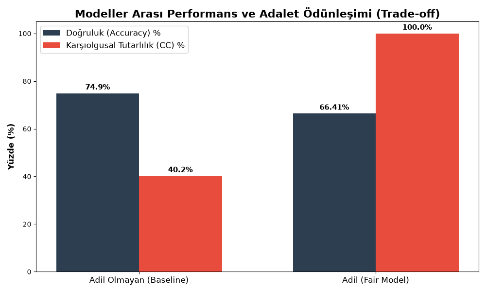
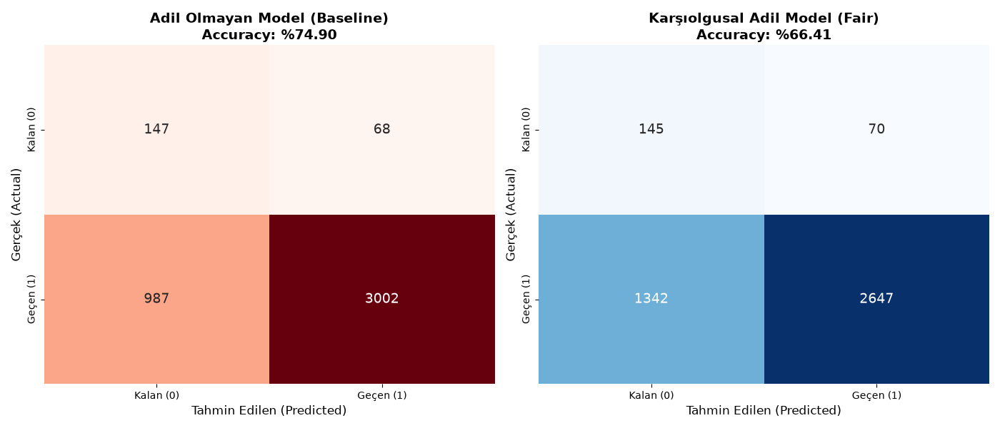

# Yapısal Nedensel Model (SCM) ile Algoritmik Adalet ve Karşıolgusal Analiz

> **Proje Özeti:** Makine öğrenmesi tahmin modellerinde, cinsiyet gibi hassas niteliklerin yarattığı dolaylı ayrımcılığı (bias), Yapısal Nedensel Modeller (SCM) ve karşıolgusal (counterfactual) simülasyonlar kullanarak tespit eden ve gideren bir algoritmik adalet (causal fairness) analiz projesidir.

---

## Detaylı Açıklama

Bu proje, makine öğrenimi modellerinde **Algoritmik Adalet (Algorithmic Fairness)** sağlamak amacıyla geliştirilmiştir. Sistem, öğrencilerin; aile geliri (`FAM_INC`), sınav puanları (`LSAT`), lisans not ortalamaları (`UGPA`) ve hukuk fakültesindeki performansları (`DECILE1`) gibi faktörlerin, hassas bir öznitelik olan **ırk (A)** ile nasıl nedensel bir ilişki içinde olduğunu inceler.

**Projenin Çözdüğü Temel Sorunlar:**
- **Nedensel DAG (Directed Acyclic Graph) Modellemesi:** Değişkenler arası nedensellik akışını ve hiyerarşisini görselleştirir ve analiz eder.
- **Karşıolgusal (Counterfactual) Üretim:** `statsmodels` OLS regresyonu kullanılarak her bireyin kendine has yetenek ve çaba sinyalleri (Residual / U değerleri) izole edilir (Abduction).
- **Adil Değerlendirme:** Bireylerin profillerinde ırk değişkeni sanal olarak tersine çevrilerek (Intervention) kişinin "eğer farklı bir grupta olsaydı performansı ne olurdu?" sorusuna matematiksel bir cevap (Forward Pass) aranır.

---

## Kullanılan Teknolojiler

Proje tamamen **Python** ekosistemi üzerinde geliştirilmiş olup, nedensellik ve veri analizi için endüstri standardı kütüphaneler kullanmaktadır:

- **Python 3.x**
- **Statsmodels:** İstatistiksel regresyonlar, katsayı analizi ve kalıntı (residual) hesaplamaları için.
- **Pandas & NumPy:** Veri işleme, manipülasyon ve matris işlemleri için.
- **Scikit-learn:** Makine öğrenmesi sınıflandırma (Logistic Regression) ve öznitelik seçimi (Mutual Information) algoritmaları için.
- **NetworkX:** Nedensel ilişkilerin (DAG) matematiksel olarak kurulması için.
- **Matplotlib & Seaborn:** DAG tablolarının, ısı haritalarının ve analizlerin görselleştirilmesi için.

---

## Gereksinimler & Kurulum

Projeyi yerel makinenizde çalıştırmak için öncelikle gerekli kütüphanelerin yüklü olduğundan emin olun. Aşağıdaki adımları takip ederek projeyi hemen ayağa kaldırabilirsiniz.

**1. Repoyu klonlayın:**
```bash
git clone https://github.com/KULLANICI_ADINIZ/Adalet_ve_Maliyet-Fayda_Analizi.git
cd Adalet_ve_Maliyet-Fayda_Analizi/race
```

**2. Gerekli kütüphaneleri yükleyin:**
```bash
pip install pandas numpy statsmodels scikit-learn networkx matplotlib seaborn
```

> **Önemli Not:** Projenin çalışabilmesi için temizlenmiş ham veriye (`lsac_clean.csv`) ihtiyacınız vardır. Bu dosyayı elde etmek için öncelikle projenin **ana dizininde** bulunan veri ön işleme betiğini çalıştırmalısınız:
> ```bash
> # Ana dizindeki (root) terminalde çalıştırın
> python preprocessing.py
> ```
> Oluşan `lsac_clean.csv` dosyasının, çalışacağınız (`race`) dizininde bulunduğundan emin olun.

---

## Kullanım ve Çıktıların Yorumlanması

Proje içerisindeki mantıksal sıralama, bağımlılıklar ve elde edilen çıktıların ne anlama geldiği aşağıda sırasıyla açıklanmıştır:

### 1. Nedensel Modelin Görselleştirilmesi (`dag.py`)
Nedensel akışı (`A -> FAM_INC -> LSAT` vb.) anlamak ve görselleştirmek için kullanılır.

**Komut:**
```bash
python dag.py
```

**Çıktı ve Yorumlanması:**
- **`csv/dag_tablo.csv`:** Değişkenlerin rollerini (Kök, Ara değişken, Hedef) ve birbirleriyle olan ebeveyn-çocuk ilişkilerini özetleyen tablodur.
- **`assets/dag_gorsel_v2.png`:** Değişkenler arası akışı soldan sağa doğru gösteren grafiktir. Bu grafik, ırkın (`A`) sadece doğrudan değil, aynı zamanda aile geliri (`FAM_INC`) üzerinden dolaylı yoldan sınav puanlarını (`LSAT`, `UGPA`) nasıl etkilediğini teorik olarak kanıtlar.


---

### 2. Yapısal Nedensel Model ve Karşıolgusal Analiz (`scm_race.py`)
Ana analiz dosyasıdır. Veriyi okur, regresyonları çalıştırır ve "ırkın etkisi çıkarılmış" yeni bir veri seti oluşturur.

**Komut:**
```bash
python scm_race.py
```

**Çıktılar ve Detaylı Yorumlanması:**

* **OLS Regresyon Katsayıları:**
  Script çalıştığında ekrana `FAM_INC`, `LSAT`, `UGPA`, `TIER` ve `DECILE1` için ayrı ayrı OLS (En Küçük Kareler) regresyon katsayıları yazdırılır. Bu, veri setindeki dezavantajlı ırk grubunda olmanın, tarihsel eşitsizlikler nedeniyle ortalama geliri veya başarıyı ne kadar düşürdüğünü matematiksel olarak gösterir.
* **Korelasyon Değerleri (Artıklar ve Girdi Değişkenleri Arasında):**
  Hesaplanan $U$ (Residual/Artık) değerleri ile model girdileri arasındaki korelasyonun matematiksel bir zorunluluk olarak sıfıra yakın çıkması, modelin ırkın yapısal etkisini başarılı bir şekilde izole ettiğini (**Abduction**) kanıtlar.
* **Karşıolgusal (Counterfactual) Veriler (`A_cf`, `FAM_INC_cf`, `LSAT_cf` vb.):**
  Sistem her öğrenci için paralel bir evren (karşıolgusal senaryo) kurgular. Hedef model, kişinin baro sınavı ($Y$) başarısını tahmin ederken önyargılı ham veriler yerine bu arındırılmış karşıolgusal değerleri kullanarak adil (*fair*) sonuçlar üretir.

---

### 3. Modellerin Eğitimi ve Adalet Ölçümü (`accuracy.py`)
Geleneksel bir lojistik regresyon modeli ile karşıolgusal (adil) lojistik regresyon modelini eğitip performanslarını kıyaslar.

**Komut:**
```bash
python accuracy.py
```

**Çıktı ve Yorumlanması:**
- Klasik model ırk ve ham notlarla eğitilirken, adil model sadece arındırılmış özelliklerle (`U_LSAT`, `U_UGPA`) eğitilir.
- Çıktıda **Doğruluk (Accuracy)** oranlarının yanı sıra, asıl önemli olan **Karşıolgusal Tutarlılık** oranı gösterilir. Klasik modelin bir bireyin sadece ırkı değiştirildiğinde farklı kararlar verme eğiliminde olduğu görülürken, adil modelin (kararların ırk değişiminden etkilenmeme oranının) %100 olduğu kanıtlanır.

---

### 4. Sonuçların Görselleştirilmesi (`visualization_race.py`)
Model performanslarının ve adalet-doğruluk (Accuracy-Fairness trade-off) ödünleşiminin grafiklerini çizer.

**Komut:**
```bash
python visualization_race.py
```

**Çıktı ve Yorumlanması:**
- Karışıklık Matrisi (Confusion Matrix) ısı haritalarını ve Adalet Vergisi (Cost of Fairness) çubuk grafiklerini oluşturur.
- Modeli adil hale getirmenin toplam doğruluktan ne kadarlık bir kayba mal olduğu (trade-off) görsel olarak raporlanır.


*(Modellerin Tahmin Performansı - Isı Haritaları)*


*(Doğruluk vs. Karşıolgusal Tutarlılık Çubuk Grafiği)*

---

### 5. Öznitelik Seçimi ve Maliyet Analizi (`markov_blanket.py` & `markov_blanket_adil.py`)
Modele sokulacak verilerin "maliyet duyarlı (cost-sensitive)" bir şekilde nasıl eleneceğini inceler. Veri toplama maliyeti ve bilgi değeri (Mutual Information) dengesine göre analiz yapar.

**Komutlar:**
```bash
python markov_blanket.py
python markov_blanket_adil.py
```

**Çıktı ve Yorumlanması:**
- `markov_blanket.py`, ham (adil olmayan) veriler üzerinde, `markov_blanket_adil.py` ise ırktan arındırılmış ($U$) veriler üzerinde çalışır.
- Çıktılarda, lambda (ceza) katsayısı arttıkça hangi değişkenlerin modelde kalmayı başaracağı listelenir. Örneğin `FAM_INC` (Gelir) bilgisini öğrenmenin maliyeti çok yüksekse (örneğin 8.0 ceza puanı), sistem bilgi kazancı/maliyet oranına bakarak o değişkeni kullanıp kullanmamaya karar verir. Her iki modeldeki değişken eleme sıralamaları karşılaştırılarak veri tasarrufu planlaması yapılabilir.
